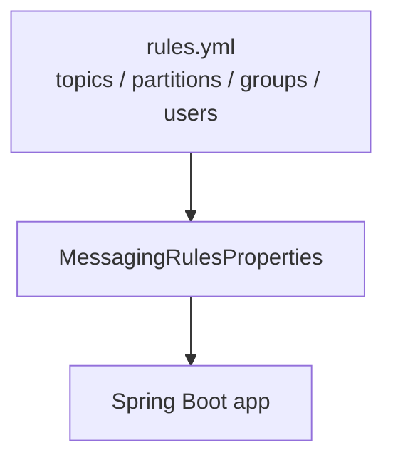
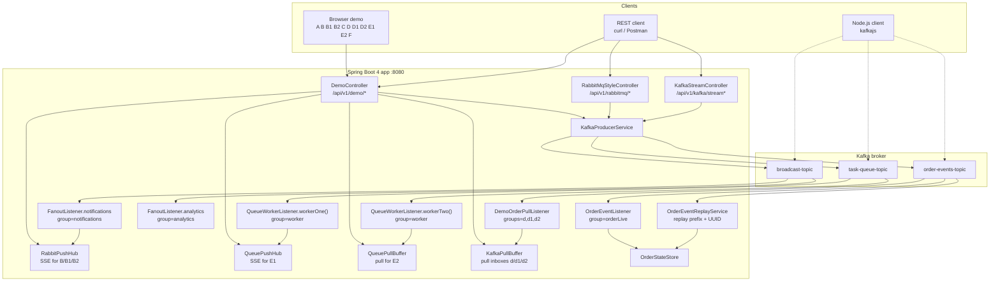
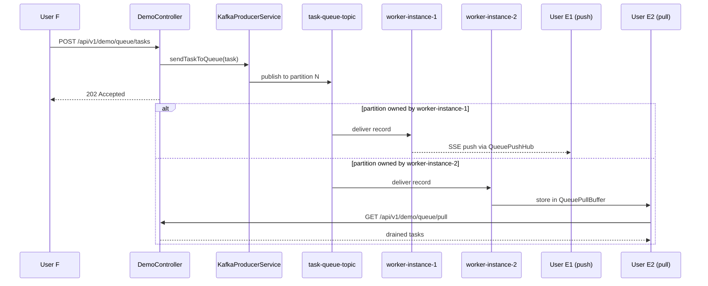
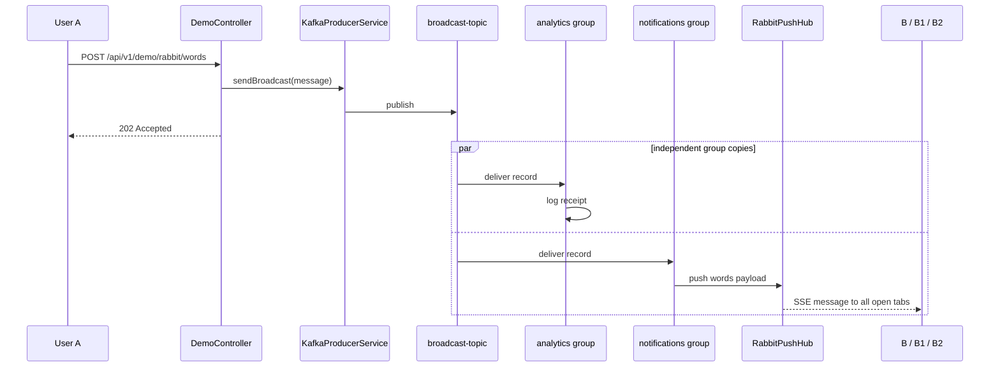
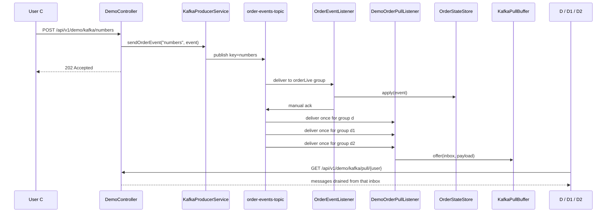
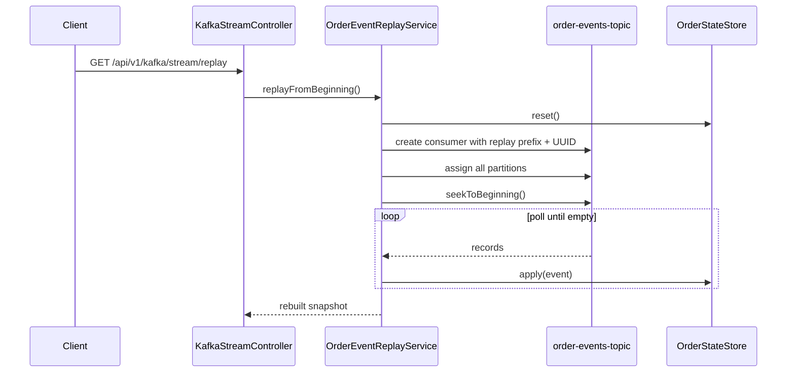
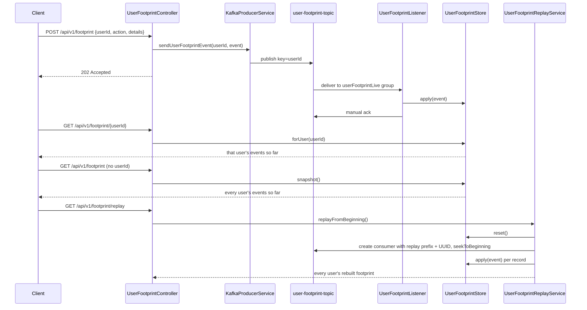

# Architecture

## 1. Solution Architecture

The service is a single Spring Boot process talking to one Kafka broker. The three topic families are still the same:

- `task-queue-topic` → work queue / competing consumers
- `broadcast-topic` → fanout / pub-sub
- `order-events-topic` → append-only event log with replay
- `user-footprint-topic` → append-only event log with replay, keyed by `userId` — tracks a user's operating footprint

What changed in the current project is that **topics, partitions, groups, and user-to-group mappings are now loaded from `rules.yml`**, not hardcoded in a Java constants file.

### 1.1 Rules-driven configuration

`src/main/resources/rules.yml` is now the source of truth for:

- topic names
- partition counts
- shared and independent Kafka consumer groups
- browser demo users (`A`, `B`, `B1`, `B2`, `C`, `D`, `D1`, `D2`, `E1`, `E2`, `F`)

`application.yml` imports that file, and `MessagingRulesProperties` binds it for runtime use.

### 1.2 High-level architecture

### 1.3 Current browser demo mapping

| Flow | Producer | Topic | Consumer UX | Kafka group behavior |
|---|---|---|---|---|
| Fanout | `A` | `broadcast-topic` | `B`, `B1`, `B2` via SSE | browser tabs share one SSE stream fed by `group-notifications` |
| Event log | `C` | `order-events-topic` | `D`, `D1`, `D2` via pull | each inbox has its **own** Kafka `groupId` |
| Work queue | `F` | `task-queue-topic` | `E1` via SSE, `E2` via pull | `worker-instance-1` and `worker-instance-2` share the **same** Kafka `groupId` |

---

## 2. Design Decisions

| Decision | Where | Why |
|---|---|---|
| Rules live in config, not constants | `rules.yml` + `MessagingRulesProperties` | Makes topic/group/user mapping editable without touching Java code |
| Queue groups are shared | `messaging.groups.worker` | Makes `workerOne` and `workerTwo` compete for tasks |
| Fanout groups are independent | `messaging.groups.analytics` / `notifications` | Gives each group its own full copy of every broadcast |
| D / D1 / D2 have separate groups | `messaging.groups.orderPull.*` | Each browser inbox can pull every `NUMBER` event independently |
| Replay uses a disposable group prefix | `messaging.groups.orderReplayPrefix` | Replay must not disturb live offsets |
| `task-queue-topic` is round-robined manually | `KafkaProducerService.sendTaskToQueue()` | Avoids sticky partitioner bias that made E1 stay empty in demos |
| `order-events-topic` keeps infinite retention | `KafkaTopicConfig` | Replay from offset 0 must remain possible |
| `user-footprint-topic` mirrors `order-events-topic` 1:1 | `UserFootprintListener` / `UserFootprintReplayService` / `UserFootprintStore` | Same event-log guarantees (keyed ordering, infinite retention, manual commit-after-apply, disposable replay group) apply directly to tracking what a user did |
| Every `DemoController` action also logs a footprint event | `DemoController.logFootprint()` | So User G's page is a real cross-pattern activity trail, not a separate demo nobody feeds |
| Browser users are not direct Kafka consumers | `DemoController` + hubs/buffers | Browsers talk HTTP/SSE; Spring listeners own the Kafka group membership |

---

## 3. Sequence Diagrams

### 3.1 Work queue (`task-queue-topic`)

`workerOne` and `workerTwo` share the same `groupId` from `messaging.groups.worker`. One task lands on one partition, and that partition belongs to exactly one worker in the group.

### 3.2 Fanout (`broadcast-topic`)

Analytics and notifications use different groups, so both groups receive every message. Browser users `B`, `B1`, and `B2` are not separate Kafka consumers; they all subscribe to the same SSE hub fed by the notifications listener.

### 3.3 Event log (`order-events-topic`)

There are two distinct consumer paths on the same topic:

1. `OrderEventListener` updates the shared projection using `group=orderLive`
2. `DemoOrderPullListener` runs three additional groups (`d`, `d1`, `d2`) so D/D1/D2 each get their own cursor

### 3.4 Replay from offset 0

Replay creates a throwaway consumer group using the prefix from `rules.yml` plus a UUID, assigns all partitions directly, and seeks to the beginning.

### 3.5 User operating footprint (`user-footprint-topic`)

Same shape as §3.3/§3.4, keyed by `userId` instead of `orderId`. `GET /api/v1/footprint/{userId}` reads the live projection directly — no replay needed — for the common "what has this user done" case; leaving off `{userId}` returns every user's live footprint; `/replay` exists for rebuilding everyone from scratch.

Footprint events aren't only produced by `POST /api/v1/footprint` directly — `DemoController` also calls the same producer method from every other demo action (A submitting words, B/B1/B2 subscribing, C submitting numbers, D/D1/D2 pulling, F submitting a task, E1 subscribing, E2 pulling), keyed by that persona's letter. So `user-footprint-topic` doubles as a cross-pattern activity log for the whole demo, and User G's page reflects real activity from every other page without anyone needing to call the footprint API by hand.

---

## 4. Operational Notes

### 4.1 Where group membership is decided

The browser pages do **not** decide Kafka groups. Group membership is decided by:

- `rules.yml` values under `messaging.groups.*`
- `@KafkaListener(groupId = "...")` placeholders
- the app wiring that connects browser pages to specific listeners, hubs, or pull inboxes

### 4.2 Inspecting current rules

You can inspect the loaded rules at:

- `GET /api/v1/demo/rules`

### 4.3 Tracking a user's operating footprint

- `POST /api/v1/footprint` `{userId, action, details}` — append one event
- `GET /api/v1/footprint` — live projection for every user
- `GET /api/v1/footprint/{userId}` — live per-user projection
- `GET /api/v1/footprint/replay` — rebuild every user's footprint from offset 0

For detailed demo paths, see [DEMO_DATAFLOWS.md](DEMO_DATAFLOWS.md).
