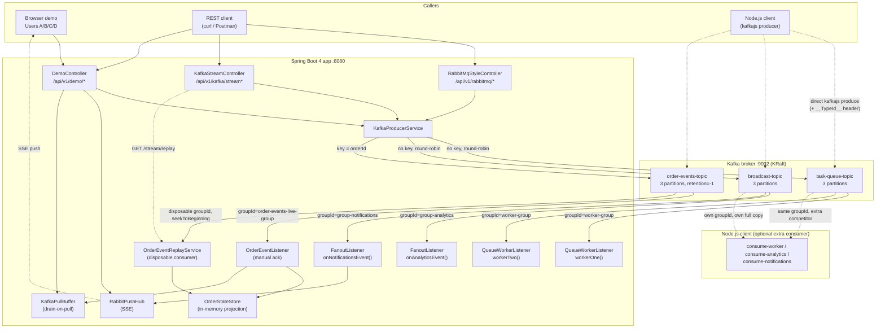
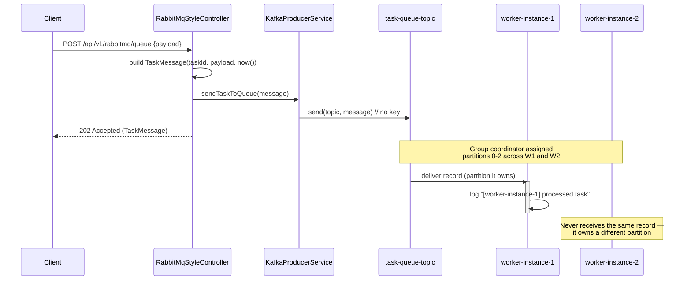
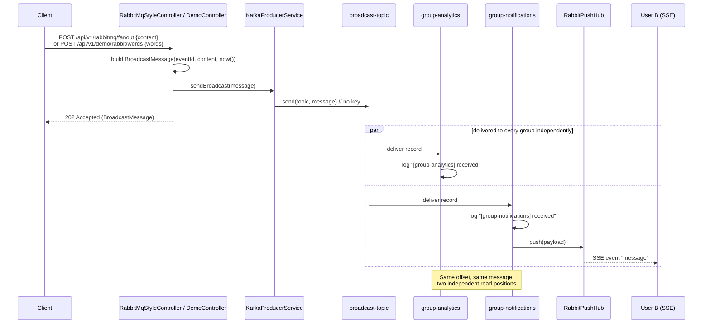
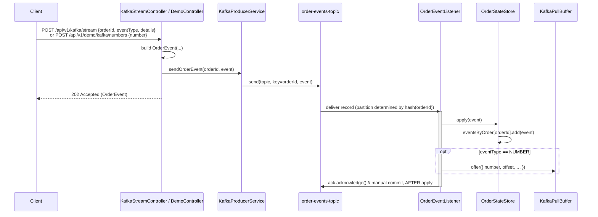
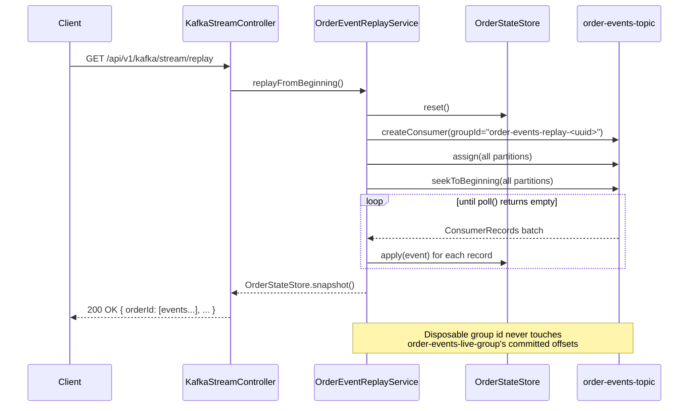

# Architecture

## 1. Solution Architecture (SA)

The service is a single Spring Boot process that talks to one Kafka broker. What changes between the three patterns is never the transport — it's **partition key presence** and **consumer group topology**.

A browser demo layer sits on top of two of those patterns:

- **RabbitMQ-style fanout → push to User B** (SSE via `RabbitPushHub`)
- **Kafka-native event log → pull by User D** (in-memory `KafkaPullBuffer`)

See also [DEMO_DATAFLOWS.md](DEMO_DATAFLOWS.md) for the A/B/C/D page sequences.

**Key design decisions:**

| Decision | Where | Why |
|---|---|---|
| No partition key on `task-queue-topic` / `broadcast-topic` | `KafkaProducerService` | Lets Kafka's partitioner spread load — required for the queue pattern to actually distribute work |
| Partition key = `orderId` on `order-events-topic` | `KafkaProducerService` | Guarantees ordering *per order*, which replay depends on |
| Same `groupId` on two listeners | `QueueWorkerListener` | Forces Kafka to split partitions between them → point-to-point |
| Different `groupId`s on two listeners | `FanoutListener` | Forces Kafka to give each its own offsets → pub/sub |
| `retention.ms = -1` | `KafkaTopicConfig` | Without infinite retention, replay-from-0 would eventually hit deleted segments |
| Separate MANUAL-ack container factory | `KafkaConsumerConfig` | Only the log-style listener commits after applying state; queue/fanout use Boot's default auto-ack |
| Disposable, UUID-suffixed group id for replay | `OrderEventReplayService` | Must never collide with, or perturb, the live listener's committed offsets |
| SSE push only from `group-notifications` | `FanoutListener` → `RabbitPushHub` | One browser delivery per fanout message (analytics still logs its own copy) |
| Pull buffer for `NUMBER` events | `OrderEventListener` → `KafkaPullBuffer` | Lets User D explicitly pull; demo of poll/fetch vs auto push |

---

## 2. Sequence Diagrams (SD)

### 2.1 RabbitMQ-style work queue (`task-queue-topic`, point-to-point)

Two listener instances share `groupId=worker-group`. Kafka's group coordinator assigns each a disjoint set of partitions, so a given message is delivered to exactly **one** of them — never both.

### 2.2 RabbitMQ-style pub/sub fanout (`broadcast-topic`)

Two listeners use *different* `groupId`s. Kafka tracks committed offsets independently per group, so both receive a full, independent copy of every message. The notifications listener also pushes to User B over SSE.

### 2.3 Kafka-native event log: append + live consumption (`order-events-topic`)

Events are keyed by `orderId`. The live listener uses **manual** acknowledgment, committing only after state has been applied — not before, and not automatically on a timer. Demo `NUMBER` events are also offered to `KafkaPullBuffer` for User D.

### 2.4 Kafka-native replay: rebuilding state from offset 0

Triggered on demand. A brand-new, disposable consumer group reads the *entire* history — proof that the log, unlike a RabbitMQ queue, still has the data after it's been "consumed" once by the live listener.

### 2.5 Browser demo: push vs pull

Teaching UX on top of §§2.2 and 2.3. Full diagrams live in [DEMO_DATAFLOWS.md](DEMO_DATAFLOWS.md).

| Demo | Producer | Broker path | Consumer UX |
|---|---|---|---|
| RabbitMQ-style push | User A → `POST /api/v1/demo/rabbit/words` | `broadcast-topic` → `FanoutListener` → `RabbitPushHub` | User B: SSE auto-update |
| Kafka-style pull | User C → `POST /api/v1/demo/kafka/numbers` | `order-events-topic` → `OrderEventListener` → `KafkaPullBuffer` | User D: `GET /api/v1/demo/kafka/pull` |
