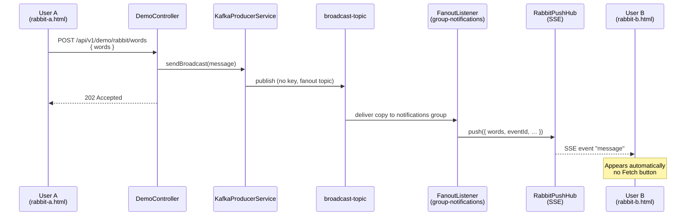
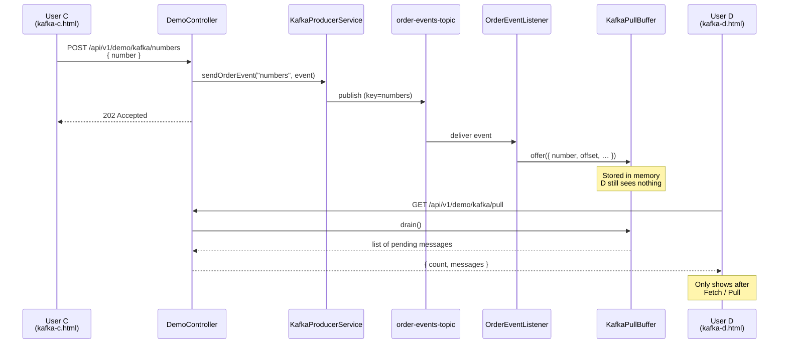

# Demo dataflows (Users A/B/C/D)

Two browser flows on top of the existing Kafka patterns:

1. **RabbitMQ-style (push)** — User A types words; User B receives them automatically (SSE).
2. **Kafka-style (pull)** — User C types numbers; User D fetches them with an explicit pull.

Pages: `http://localhost:8080/` → `rabbit-a.html`, `rabbit-b.html`, `kafka-c.html`, `kafka-d.html`.

---

## 1. RabbitMQ-style (push) — User A → User B

**Idea:** A publishes once; B is already subscribed over SSE, so the page updates when the fanout listener receives the Kafka message.

| Step | Component | Action |
|------|-----------|--------|
| 1 | User A | `POST /api/v1/demo/rabbit/words` |
| 2 | `KafkaProducerService` | Write to `broadcast-topic` |
| 3 | `FanoutListener` (`group-notifications`) | Consume fanout copy |
| 4 | `RabbitPushHub` | Push to open SSE subscribers |
| 5 | User B | Message appears with no button click |

---

## 2. Kafka-style (pull) — User C → User D

**Idea:** C appends to the Kafka log; the live listener buffers events. D only sees them when they **pull** (drain the buffer).

| Step | Component | Action |
|------|-----------|--------|
| 1 | User C | `POST /api/v1/demo/kafka/numbers` |
| 2 | `KafkaProducerService` | Append to `order-events-topic` (key=`numbers`) |
| 3 | `OrderEventListener` | Apply state + `KafkaPullBuffer.offer` |
| 4 | User D | `GET /api/v1/demo/kafka/pull` |
| 5 | `KafkaPullBuffer` | `drain()` → return pending batch |

---

## Side-by-side

| | RabbitMQ-style (A→B) | Kafka-style (C→D) |
|--|----------------------|-------------------|
| Topic | `broadcast-topic` | `order-events-topic` |
| Producer page | User A (words) | User C (numbers) |
| Consumer page | User B | User D |
| Delivery to browser | **Push** (SSE) | **Pull** (HTTP GET) |
| User action on receive | None | Click **Fetch / Pull** |
| API produce | `POST /api/v1/demo/rabbit/words` | `POST /api/v1/demo/kafka/numbers` |
| API consume | `GET /api/v1/demo/rabbit/live` (SSE) | `GET /api/v1/demo/kafka/pull` |

> Note: both flows still use **Kafka** as the broker. “RabbitMQ-style” / “Kafka-style” here describe the **browser delivery pattern** (push vs pull) on top of the project’s fanout and event-log topics.
