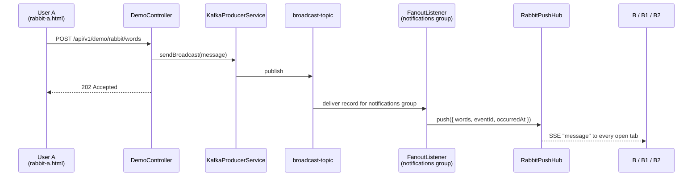
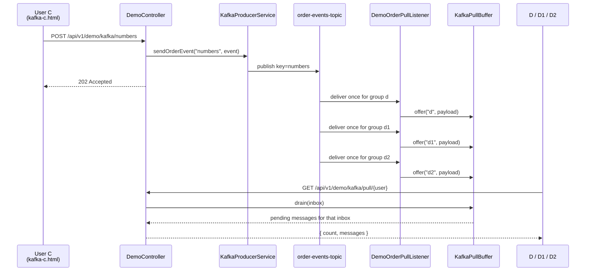
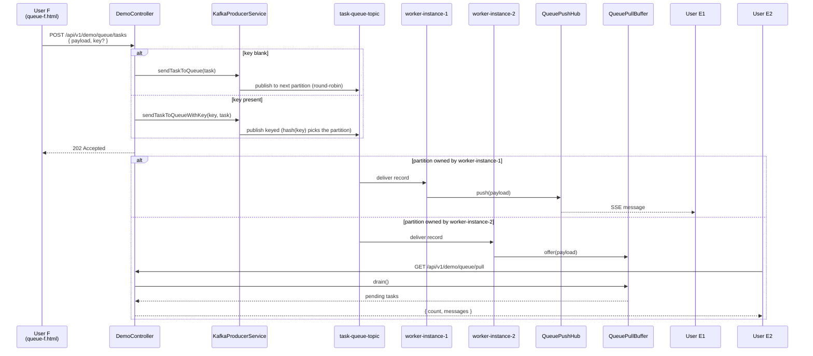
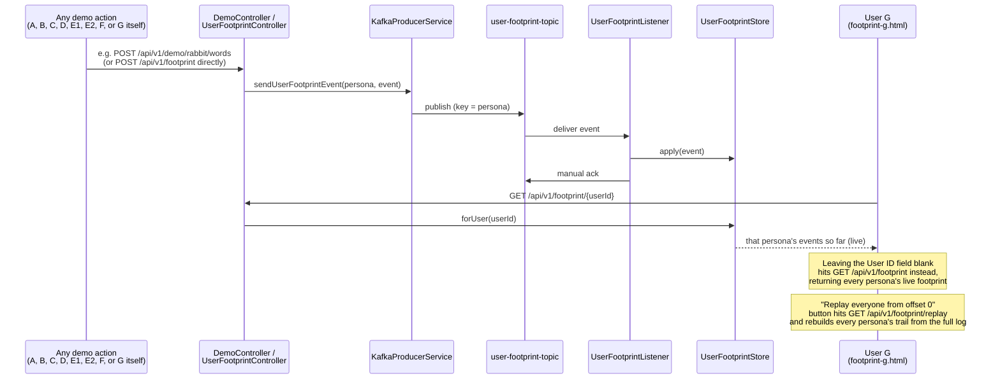

# Demo dataflows

Current browser demo users:

- Fanout: `A` → `B`, `B1`, `B2`
- Event log: `C` → `D`, `D1`, `D2`
- Work queue: `F` → `E1` or `E2`
- User footprint: `G` produces and reads its own trail; every other action (A-F) also logs a footprint event automatically

All pages are served from `http://localhost:8080/`.

---

## 1. Fanout push — User A → Users B / B1 / B2

All three browser tabs subscribe to the same SSE endpoint. They are **not** separate Kafka consumer groups. The Kafka-side fanout still happens between `group-analytics` and `group-notifications`, and the notifications listener fans out again to all open SSE clients.

| Step | Component | Action |
|---|---|---|
| 1 | User A | `POST /api/v1/demo/rabbit/words` |
| 2 | `KafkaProducerService` | Publish to `broadcast-topic` |
| 3 | `FanoutListener` | Consume as `group-notifications` |
| 4 | `RabbitPushHub` | Broadcast to all SSE subscribers |
| 5 | `B`, `B1`, `B2` | All receive the same browser message |

---

## 2. Event-log pull — User C → Users D / D1 / D2

`D`, `D1`, and `D2` each have a **different Kafka `groupId`** configured in `rules.yml`. That means each one gets its own offset cursor on `order-events-topic`, so each can pull every `NUMBER` event independently.

| Step | Component | Action |
|---|---|---|
| 1 | User C | `POST /api/v1/demo/kafka/numbers` |
| 2 | `KafkaProducerService` | Append to `order-events-topic` |
| 3 | `DemoOrderPullListener` | Consume once per group: `d`, `d1`, `d2` |
| 4 | `KafkaPullBuffer` | Store payloads in named inboxes |
| 5 | `D` / `D1` / `D2` | Pull via `/api/v1/demo/kafka/pull/{user}` |

---

## 3. Work queue — User F → User E1 or E2

`E1` and `E2` are backed by two listeners in the **same** Kafka group. Each task is processed by only one worker:

- `worker-instance-1` → pushed to `E1`
- `worker-instance-2` → buffered for `E2`

| Step | Component | Action |
|---|---|---|
| 1 | User F | `POST /api/v1/demo/queue/tasks` with `payload`, optional `key` |
| 2 | `KafkaProducerService` | No key: round-robins partitions manually. With key: lets Kafka hash the key to a partition |
| 3 | `QueueWorkerListener` | Exactly one worker receives each task |
| 4 | `QueuePushHub` / `QueuePullBuffer` | Route to E1 push or E2 pull |
| 5 | `E1` / `E2` | Only one side sees a given task |

**With vs without a key:** submit several tasks with no key and they'll bounce between E1 and E2 (round-robin across partitions). Submit several with the *same* key (e.g. `customer-7`) and they'll all land on the same partition — and therefore always the same worker — every time, because Kafka's partitioner hashes the key deterministically. That's the same mechanism `order-events-topic` (keyed by `orderId`) and `user-footprint-topic` (keyed by `userId`) rely on for per-entity ordering; this endpoint just lets you opt into it on a topic that's normally unkeyed, side by side, for comparison.

---

## 4. User operating footprint — User G, fed by A-F

`user-footprint-topic` has two kinds of producers: User G's own "Log action" panel, **and** every other demo action (A submitting words, B/B1/B2 subscribing, C submitting numbers, D/D1/D2 pulling, F submitting a task, E1 subscribing, E2 pulling). `DemoController` calls the same `sendUserFootprintEvent(userId, event)` after each of its existing actions, keyed by that persona's letter — so G's page is a real cross-pattern activity trail for the whole demo, not an isolated feature nobody else feeds.

**Idea:** unlike A→B and C→D, User G's own actions are a single-persona flow — G both produces (logs actions under a userId) and consumes (reads that user's own trail), because tracking a footprint is inherently keyed by identity rather than split across producer/consumer roles. What makes the page interesting in practice is that it's *not* only fed by itself: open `rabbit-a.html`, submit words, then load `footprint-g.html` with the User ID field blank — `A`'s `WORDS_SUBMITTED` event is already there. Leaving the User ID field blank switches "Fetch" from one persona's live trail to everyone's; the separate "replay" panel demonstrates that the log — not just the in-memory projection — is the source of truth.

---

## Side-by-side

| Flow | Topic | Producer | Consumers | Browser delivery | Kafka group behavior |
|---|---|---|---|---|---|
| Fanout | `broadcast-topic` | `A` | `B`, `B1`, `B2` | Push (SSE) | Different Kafka groups inside app; browser tabs share one SSE feed |
| Event log | `order-events-topic` | `C` | `D`, `D1`, `D2` | Pull (HTTP GET) | Three different Kafka groups, one per inbox |
| Work queue | `task-queue-topic` | `F` | `E1`, `E2` | E1 push, E2 pull | Same Kafka group, competing workers |
| User footprint | `user-footprint-topic` | `G` | `G` (itself) | Pull (HTTP GET), plus full replay | One live group (keyed by userId) + disposable replay group |

> Note: all four demos still use **Kafka** as the broker. The page behavior is implemented by Spring listeners, SSE hubs, and pull buffers on top of Kafka topics and consumer groups.
